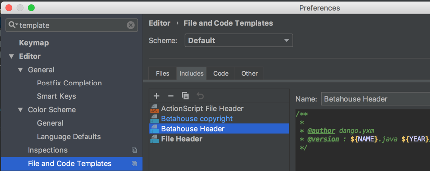
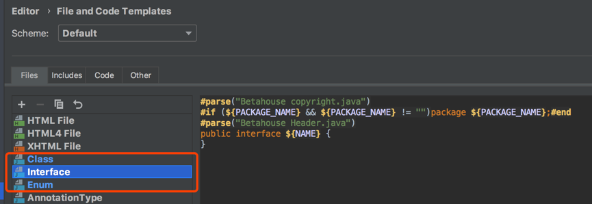
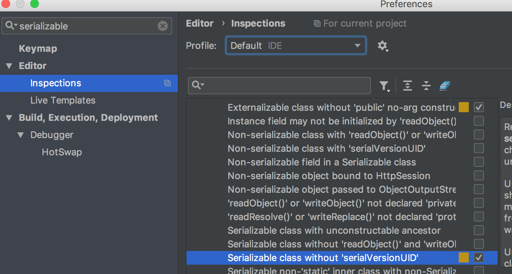
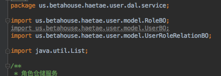

# β-house 项目开发规范  

### IDE及开发环境

- IntelliJ IDEA

1. 代码文件头和代码注解设置位置：Editor > File and Code Template > Includes 新增两条内容：

    1. Betahouse Copyright
    ```java
    /**
    * betahouse.us
    * CopyRight (c) 2012 - ${YEAR}
    */
    ```

    2. Betahouse Header

    ```java
    /**
    * @author ${USER}
    * @version : ${NAME}.java ${YEAR}/${MONTH}/${DAY} ${TIME} ${USER}
    */
    ```
    

2. 之后配置在 Files 里面对应 Class Interface Enum 配置上  

      

3. 序列化的对象务必写序列化id serialVersionUID   

    

    > 可以在 idea 上配置序列化对象无序列化id 警告  


---

### GIT

1. 使用git协作时，除了基础配置，还需配置

```bash
git config –global user.name “your_id.your_name”
```

建议用户名为 **花名.姓名缩写** ，例如：dango.yxm, Coink.wc

2. 提交commit时，需认真描述当前提交的commit内容，例如：

```bash
git commit -m "新增记录员批量删除接口"
```

---

### 注释与代码规范

1. 所有class,interface,enum需详细注解

2. 所有Interface的接口上面需有接口描述

3. 所有成员变量上需要注解描述含义

4. 复杂的boolean判断需拆出，严禁出现 switch等没有明确寓意的boolean变量，建议使用switchOn/switchOff

5. 代码中不能出现魔法值，尽量使用常量、常量类或枚举类管理

6. 注意PMD问题(不必要的变量/引用等)  
    

7. 数据库建库时索引命名规范, 唯一索引名称用 uk_xxx , 一般索引名称 idx_xxx。 xxx为对应的字段名称  
例如: idx_open_id, uk_user_id_user_info_id等

**建议阅读《阿里巴巴JAVA开发手册》**

---

### 其他配置文件

注：README/COPYING/LICENSE/NOTICE/CHANGES 等文件名均采用大写

<font color="#f00">**warning!!! 请不要将任何服务器配置文件上传到 github**</font>

---

#### README.md

README应包含以下内容（根据项目实际情况选择）：

- 项目名称与LOGO
- 项目内容、目的
- 语言与框架信息
- 构建、测试结果
- Demo、官网地址
- [徽章](https://shields.io/#/)
- 安装及快速开始
- API使用文档
- FAQ
- 贡献
- 版权信息

参考：[AntDesign的README界面](https://github.com/ant-design/ant-design/blob/master/README.md)

---

#### CHANGELOG.md

> ### 更新日志是什么？
>
> 更新日志（Change Log）是一个由人工编辑，以时间为倒叙的列表， 以记录一个项目中所有版本的显著变动。
>
> ### 为何要提供更新日志？
>
> 为了让用户和开发人员更简单明确的知晓项目在不同版本之间有哪些显著变动。
>
> ### 哪些人需要更新日志？
>
> 人人需要更新日志。无论是消费者还是开发者，软件的最终用户都关心软件所包含什么。 当软件有所变动时，大家希望知道改动是为何、以及如何进行的。

遵照规范：

https://keepachangelog.com/zh-CN/1.0.0/

---

### 关于CodeReview & 发布

1. 发布前建议有2人(含开发)及以上进行CR。

2. 线上发布前需告知项目负责人统筹其他相关方。

---

### 其他

1. 所有变更必须同步负责人或指导老师(含发布, 数据库数据订正, 服务器重启等)

2. <font color="#f00">**严禁私自篡改或利用数据，一经发现，严肃处理。**</font>

3. 遵守开源社区规则，开源软件不应用于任何形式的商用用途